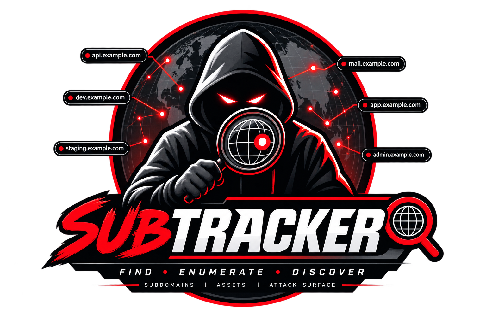

<p align="center">
  
</p>

# SubTracker

> **Professional Subdomain Discovery CLI Tool — Powered by [AgniOps](https://agniops.in) Intelligence Node**

```
  ███████╗██╗   ██╗██████╗ ████████╗██████╗  █████╗  ██████╗██╗  ██╗███████╗██████╗
  ██╔════╝██║   ██║██╔══██╗╚══██╔══╝██╔══██╗██╔══██╗██╔════╝██║ ██╔╝██╔════╝██╔══██╗
  ███████╗██║   ██║██████╔╝   ██║   ██████╔╝███████║██║     █████╔╝ █████╗  ██████╔╝
  ╚════██║██║   ██║██╔══██╗   ██║   ██╔══██╗██╔══██║██║     ██╔═██╗ ██╔══╝  ██╔══██╗
  ███████║╚██████╔╝██████╔╝   ██║   ██║  ██║██║  ██║╚██████╗██║  ██╗███████╗██║  ██║
  ╚══════╝ ╚═════╝ ╚═════╝    ╚═╝   ╚═╝  ╚═╝╚═╝  ╚═╝ ╚═════╝╚═╝  ╚═╝╚══════╝╚═╝  ╚═╝
```

[](https://golang.org)
[](https://github.com)
[](LICENSE)

---

## Features

- 🔍 **Fast subdomain discovery** via the AgniOps Intelligence API
- 🌐 **Cross-platform** — Linux, Windows, macOS (amd64 + arm64)
- 🎨 **Rich terminal output** — coloured table with Cloudflare detection
- 📄 **Multiple export formats** — JSON, CSV, plain text
- 🔒 **Secure config** — API key stored with 0600 permissions
- 📊 **Quota tracking** — see remaining daily scans after every request
- 💨 **Animated spinner** — visual feedback during scan

---

## Installation

### Option 1 — Pre-built binaries (recommended)

Download the binary for your platform from the [Releases](../../releases) page:

| Platform       | File                              |
|----------------|-----------------------------------|
| Linux (amd64)  | `subtracker-linux-amd64`          |
| Linux (arm64)  | `subtracker-linux-arm64`          |
| macOS (Intel)  | `subtracker-darwin-amd64`         |
| macOS (M1/M2)  | `subtracker-darwin-arm64`         |
| Windows        | `subtracker-windows-amd64.exe`    |

**Linux / macOS:**
```bash
chmod +x subtracker-linux-amd64
sudo mv subtracker-linux-amd64 /usr/local/bin/subtracker
```

**Windows:**  
Rename to `subtracker.exe` and add its folder to your `PATH`.

### Option 2 — Build from source

```bash
git clone https://github.com/un9nplayer/subtracker.git
cd subtracker
go build -o subtracker .
```

### Option 3 — `go install`

```bash
go install github.com/un9nplayer/subtracker@latest
```

---

## Quick Start

### Step 1 — Configure your API key

```bash
subtracker configure
```

```
  ┌──────────────────────────────────────────┐
  │   SubTracker — API Key Configuration     │
  └──────────────────────────────────────────┘

  Enter your AgniOps API key: at_live_••••••••••••••••••

  ✔  API key saved successfully!
  📁 Config file: /home/user/.subtracker/config.json
```

Your API key is stored at:
- **Linux/macOS**: `~/.subtracker/config.json`
- **Windows**: `%APPDATA%\.subtracker\config.json`

### Step 2 — Run your first scan

```bash
subtracker scan --domain agniops.in
```

```
  ╔══════════════════════════════════════════════╗
  ║        SubTracker — Scan Results             ║
  ╚══════════════════════════════════════════════╝

  🌐 Domain      : agniops.in
  🔍 Engine      : AgniTracker Intelligence Node
  🗺  Country     : Global
  🔝 Top IP      : 188.114.96.3
  📅 Scan Date   : 8/4/2026, 7:03:28 PM
  ✔  Found       : 12 subdomain(s)

  ─────┼──────────────────────────┼─────────────────┼──────────────
   #   │ Subdomain                │ IP Address       │ Cloudflare
  ─────┼──────────────────────────┼─────────────────┼──────────────
   1   │ academy.agniops.in       │ 34.149.87.45     │   ✗ No
   2   │ app.agniops.in           │ 188.114.96.3     │   ✔ Yes
   3   │ ctrl.agniops.in          │ 188.114.96.3     │   ✔ Yes
  ...
  ─────┴──────────────────────────┴─────────────────┴──────────────

  📊 Quota remaining today: 997 / 1000
  ✔  Scan complete in 2.34s
```

---

## Command Reference

### `subtracker configure`

Set up or update your AgniOps API key.

```bash
subtracker configure
```

---

### `subtracker scan`

Discover subdomains for a target domain.

```
Flags:
  -d, --domain    string   Target domain to scan (required)
  -o, --output   string   Output format: table | json | plain | csv  (default: table)
  -f, --out-file string   Save results to a file (optional)
  -t, --timeout  int      HTTP timeout in seconds  (default: 30)
```

**Examples:**

```bash
# Default rich table output
subtracker scan -d example.com

# Export as JSON
subtracker scan -d example.com -o json

# Export as CSV and save to file
subtracker scan -d example.com -o csv --out-file results.csv

# Plain text (pipe-friendly)
subtracker scan -d example.com -o plain | sort | uniq

# Save plain text to file
subtracker scan -d example.com -o plain -f subdomains.txt

# Custom timeout (60 seconds)
subtracker scan -d example.com -t 60
```

---

### `subtracker --version`

Print version information.

```bash
subtracker --version
```

---

## Output Formats

| Format  | Description                                   | Pipe-friendly |
|---------|-----------------------------------------------|---------------|
| `table` | Coloured ASCII table (default)                | No            |
| `json`  | Full API response as pretty-printed JSON      | Yes           |
| `plain` | One subdomain per line                        | ✔ Yes         |
| `csv`   | `Subdomain,IP Address,Cloudflare` rows        | ✔ Yes         |

---

## Building for All Platforms

```bash
# Build for current OS
make build

# Cross-compile for all platforms (outputs to dist/)
make release
```

Supported targets:
- `linux/amd64`, `linux/arm64`
- `darwin/amd64` (Intel Mac), `darwin/arm64` (Apple Silicon)
- `windows/amd64`

---

## API Information

SubTracker uses the **AgniOps Subdomain Scan API**:

- **Endpoint**: `POST https://app.agniops.in/api/v1/subdomains/scan`
- **Auth**: `X-API-Key` header
- **Daily quota**: 1,000 scans (shown after each scan)
- **Rate limit**: ~10 requests/minute

Get your API key at [app.agniops.in](https://app.agniops.in).

---

## License

MIT © 2026 — Built with ❤️ using Go and AgniOps Intelligence.
